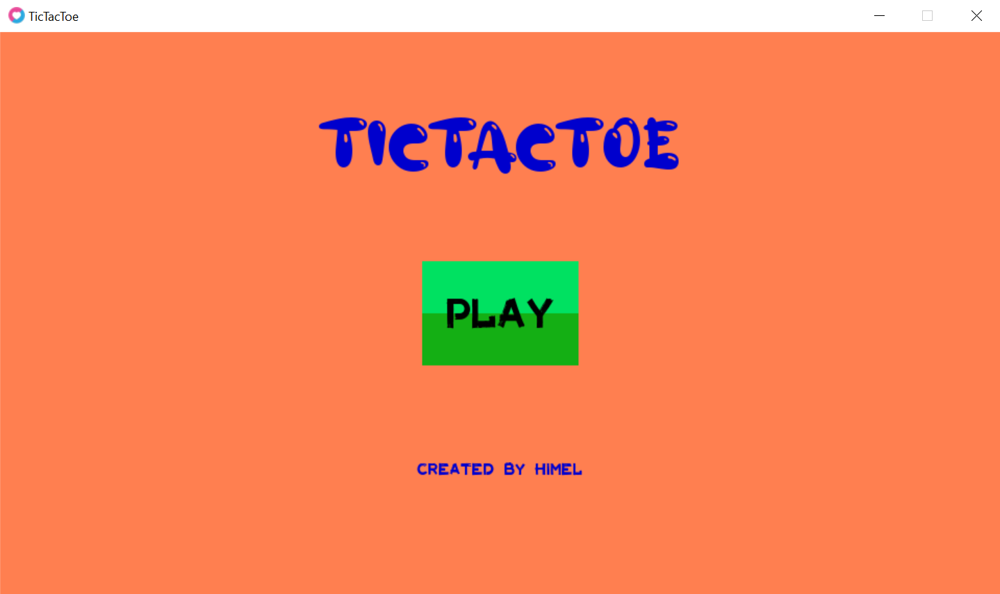
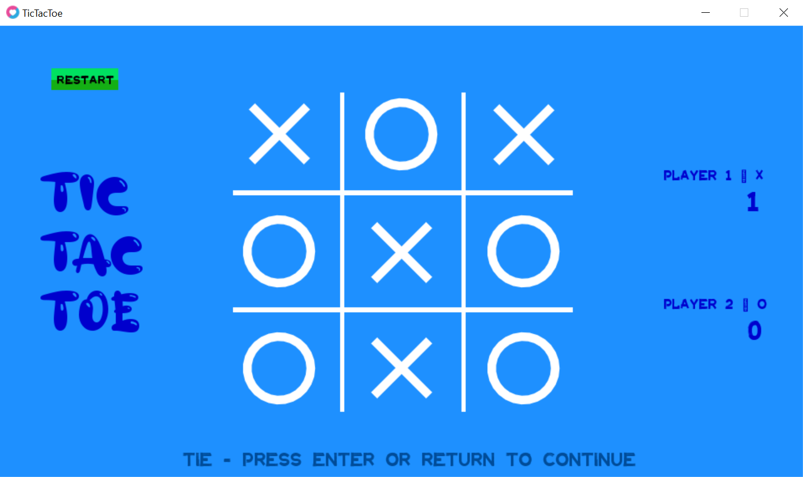
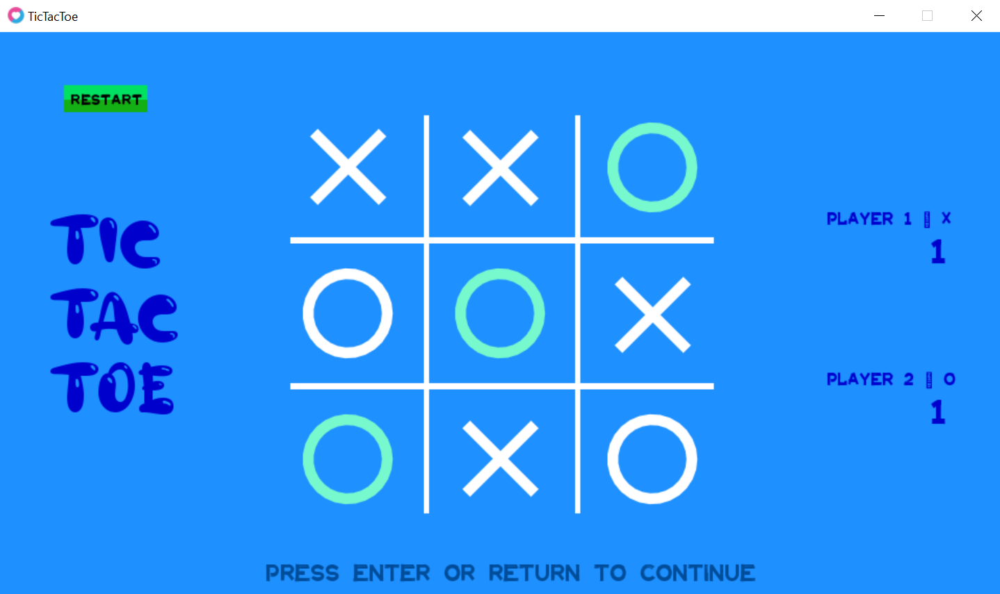
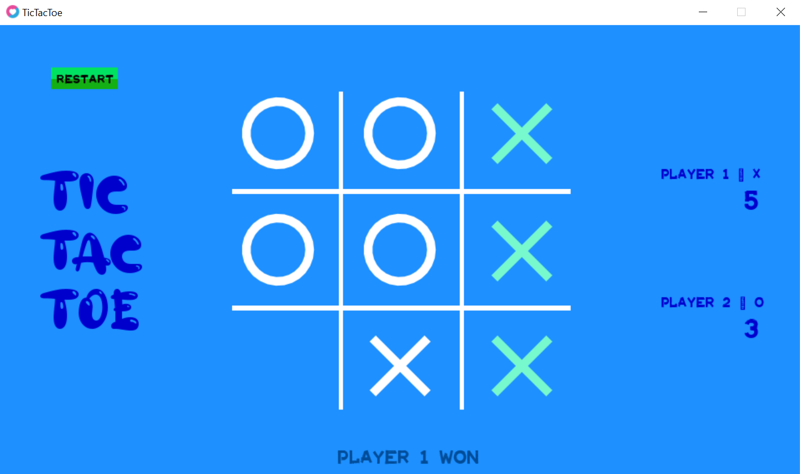

# TICTACTOE COM LOVE
👨‍💻ESSE É UM JOGO CLÁSSICO DO TIC-TAC-TOE (JOGO DA VELHA) DESENVOLVIDA COM O FRAMEWORK LOVE2D EM LUA.

 <br>
 <br>
 <br>
 <br>

## DESCRIÇÃO:
1. **Tela Inicial:** Ao iniciar o jogo, o jogador é apresentado a uma tela inicial com um design simples e intuitivo, contendo o título do jogo e um botão "PLAY". Ao clicar no botão, o jogador é direcionado para a tela de jogo.
2. **Tela de Jogo:** A tela de jogo apresenta um tabuleiro 3x3 dividido em nove casas. Os jogadores alternam suas jogadas, colocando suas respectivas marcas (X ou O) em uma casa vazia. O objetivo é conseguir alinhar três de suas marcas em uma linha horizontal, vertical ou diagonal.
3. **Mecânica do Jogo:**
    * **Vez de cada jogador:** O jogo alterna entre os dois jogadores, permitindo que cada um faça uma jogada por vez.
    * **Verificação de vitória:** Após cada jogada, o jogo verifica se algum jogador conseguiu alinhar três de suas marcas. Caso sim, a partida é encerrada e o jogador vencedor é anunciado.
    * **Empate:** Se todas as casas do tabuleiro forem preenchidas e nenhum jogador tiver conseguido alinhar três marcas, a partida termina em empate.
4. **Tela de Fim de Jogo:** Ao final de cada partida, o jogo exibe a tela de fim de jogo, indicando o vencedor (ou empate) e atualizando as pontuações dos jogadores. Um botão "RESTART" permite que os jogadores iniciem uma nova partida imediatamente.

## CARACTERISTICAS:
* **Design atrativo:** O design do jogo é simples, mas agradável, com uma paleta de cores harmoniosa e uma tipografia adequada.
* **Funcionalidades adicionais:** Além da mecânica básica do Tic-Tac-Toe, o jogo oferece algumas funcionalidades adicionais, como:
    * **Contagem de pontos:** O jogo acompanha o número de vitórias de cada jogador, adicionando um elemento competitivo.
    * **Botão "RESTART":** Permite que os jogadores reiniciem a partida rapidamente.
* **Personalização:** Embora não tenha sido explicitado nas imagens analisadas, é possível que o jogo permita alguma personalização, como a escolha das cores ou dos símbolos dos jogadores.

## COMO JOGAR?
### INSTALANDO O APK:
   - **Download do APK**: Acesse a pasta `./APK/` e encontre o arquivo `NomeDoApp.apk`.
   - **Transferência para o dispositivo**: Transfira o arquivo APK para o seu dispositivo Android. Isso pode ser feito via cabo USB, Google Drive, email ou qualquer outro método de transferência de arquivos.
   - **Instalação**:
     1. No dispositivo Android, vá para `Configurações` > `Segurança` e habilite a opção `Fontes desconhecidas` (Isso permite a instalação de aplicativos fora da Google Play Store).
     2. Navegue até o local onde o APK foi salvo (usando um gerenciador de arquivos).
     3. Toque no arquivo `NomeDoApp.apk` para iniciar a instalação.
     4. Siga as instruções na tela para concluir a instalação.
   - **Execução**: Após a instalação, você pode abrir o aplicativo diretamente da tela de instalação ou encontrá-lo na gaveta de aplicativos do seu dispositivo.

### EXECUTANDO O CÓDIGO:
1. **Execute o Jogo**: 
  - Abra o terminal (ou prompt de comando) e navegue até a pasta `./main.lua`.
  - Execute o comando:

   ```bash
   love .
   ```

  - Isso deve abrir uma janela do LÖVE com o jogo do TICTACTOE.

2. **Escolha uma casa:** 
  - Clique na casa vazia onde você deseja colocar sua marca (X ou O).

3. **Revezem-se:** 
  - Cada jogador, por sua vez, escolhe uma casa vazia para marcar.

4. **Alinhe três:** 
  - O objetivo é conseguir três de suas marcas em uma linha reta, seja horizontal, vertical ou diagonal. 
5. **Ganha quem fizer três primeiro:** 
  - O primeiro jogador a conseguir alinhar três de suas marcas vence o jogo.

6. **Empate:** 
  - Se todas as casas forem preenchidas e nenhum jogador tiver conseguido alinhar três marcas, o jogo termina em empate.

## NÃO SABE?
- Entendemos que para manipular arquivos em muitas linguagens e tecnologias, é necessário possuir conhecimento nessas áreas. Para auxiliar nesse aprendizado, oferecemos cursos gratuitos disponíveis:
* [CURSO DE LOVE](https://github.com/VILHALVA/CURSO-DE-LOVE)
* [CURSO DE LUA](https://github.com/VILHALVA/CURSO-DE-LUA)
* [CONFIRA MAIS CURSOS](https://github.com/VILHALVA?tab=repositories&q=+topic:CURSO)

## CREDITOS:
- [PROJETO CRIADO PELO "himelsaha29"](https://github.com/himelsaha29/TicTacToe_Remastered)
- [PROJETO EDITADO PELO VILHALVA](https://github.com/VILHALVA)
